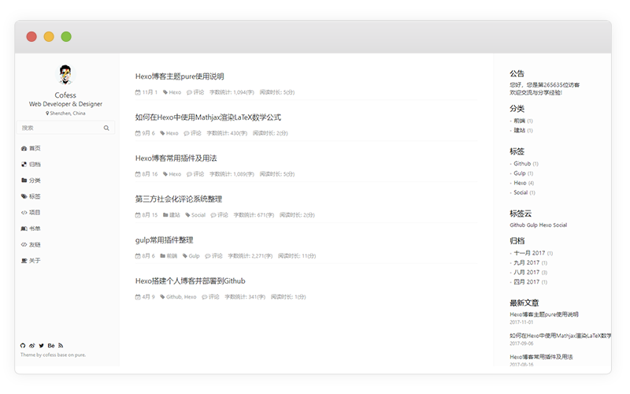

# dawn

A brand new default theme for [[Hexo](https://hexo.io)].  
[Preview](http://Ruffianjiang.github.io/) | [中文说明文档](README.cn.md) | [iconfont](http://blog.cofess.com/hexo-theme-pure/iconfont/demo_fontclass.html)



## Features

- Multiple languages support
- Comment support
- Tags page
- Categories page
- Social Media

## Skins


## Appearance

[Home](http://Ruffianjiang.github.io/) |
[Archives](http://Ruffianjiang.github.io/archives/) |
[Categories](http://Ruffianjiang.github.io/categories/) |
[Tags](http://Ruffianjiang.github.io/tags/) |
[Repository](http://Ruffianjiang.github.io/repository/) |
[Books](http://Ruffianjiang.github.io/books/) |
[Links](http://Ruffianjiang.github.io/links/) |
[About](http://Ruffianjiang.github.io/about/)

## Quick start
> 在 Hexo中有两份主要的配置文件，其名称都是 _config.yml。 其中，一份位于站点根目录下，主要包含 Hexo 本身的配置；另一份位于主题目录下，这份配置由主题作者提供，主要用于配置主题相关的选项。为了描述方便，在以下说明中，将前者称为站点配置文件， 后者称为主题配置文件。

第一步、站点根目录下执行如下命令，下载主题
```shell
git clone https://github.com/Ruffianjiang/hexo-theme-dawn.git themes/dawn
```

需要更新时，使用如下命令
```shell
cd themes/dawn
git pull
```

第二步、主题目录下配置文件`_config.yml`复制一份到站点目录下，重命名为`_config.dawn.yml`
> `_config.yml`和`_config.dawn.yml.light`内容一致，为轻量配置，开箱即用，建议初次安装使用此配置，`_config.dawn.yml.all`为全部配置，需要安装一些插件，推荐部署好站点后，需要定制插件时，作为参考使用

第三步、打开站点目录下的配置文件`_config.yml`，找到`theme`字段，将其值更改为`dawn`
```yaml
theme: dawn
```

第四步、编译并启动
```shell
hexo clean & hexo generate & hexo serve
```

访问`localhost:4000`现在来看看你的博客吧~~

其他定制功能，请访问 [wiki](https://github.com/Ruffianjiang/hexo-theme-dawn/wiki)


## Install plugin

### [hexo-wordcount](https://github.com/willin/hexo-wordcount)

```
npm install hexo-wordcount --save
```
### [hexo-generator-json-content](https://github.com/alexbruno/hexo-generator-json-content)

```
npm install hexo-generator-json-content --save
```
### [hexo-generator-feed](https://github.com/hexojs/hexo-generator-feed)

```
npm install hexo-generator-feed --save
```
### [hexo-generator-sitemap](https://github.com/hexojs/hexo-generator-sitemap)

```
npm install hexo-generator-sitemap --save
```
### [hexo-generator-baidu-sitemap](https://github.com/coneycode/hexo-generator-baidu-sitemap)

```
npm install hexo-generator-baidu-sitemap --save
```
## Data files
Sometimes you may need to use some data in templates which is not directly available in your posts, or you want to reuse the data elsewhere. For such use cases, Hexo 3 introduced the new Data files. This feature loads YAML or JSON files in source/_data folder so you can use them in your site.

For example, add links.yml in source/_data folder.

### links data

add links.yml in source/_data folder.

The format of the link :

```
Name:
    link: http://example.com
    avatar: http://example.com/avatar.png
    desc: description
```
Add a number of links, we just need to repeat the format according to the above.

## Blog optimization

### [hexo-neat](https://github.com/rozbo/hexo-neat)

> auto Minify html、js、css and make it neat

```
npm install hexo-neat --save
```

You can configure this plugin in `_config.yml`.

```
# hexo-neat
neat_enable: true
neat_html:
  enable: true
  exclude:  
neat_css:
  enable: true
  exclude:
    - '*.min.css'
neat_js:
  enable: true
  mangle: true
  output:
  compress:
  exclude:
    - '*.min.js' 
```

### [hexo-baidu-url-submit](https://github.com/huiwang/hexo-baidu-url-submit)

```
npm install hexo-baidu-url-submit --save
```

### [hexo-translate-title](https://github.com/cometlj/hexo-translate-title)
> translate the chinese title of Hexo blog to english words automatially

```
npm install hexo-translate-title --save
```

You can configure this plugin in `_config.yml`.

```yml
translate_title:
  translate_way: google    #google | baidu | youdao
  youdao_api_key: XXX
  youdao_keyfrom: XXX
  is_need_proxy: true     #true | false
  proxy_url: http://localhost:8123
```
## Mathjax Support

### [hexo-renderer-markdown-it-plus](https://github.com/CHENXCHEN/hexo-renderer-markdown-it-plus)

install

```
npm un hexo-renderer-marked --save
npm i hexo-renderer-markdown-it-plus --save
```

You can configure this plugin in `_config.yml`.

```
markdown_it_plus:
  highlight: true
  html: true
  xhtmlOut: true
  breaks: true
  langPrefix:
  linkify: true
  typographer:
  quotes: “”‘’
  plugins:
    - plugin:
        name: markdown-it-katex
        enable: true
    - plugin:
        name: markdown-it-mark
        enable: false  
```

Article enable mathjax

```
title: Hello World
mathjax: true
```

